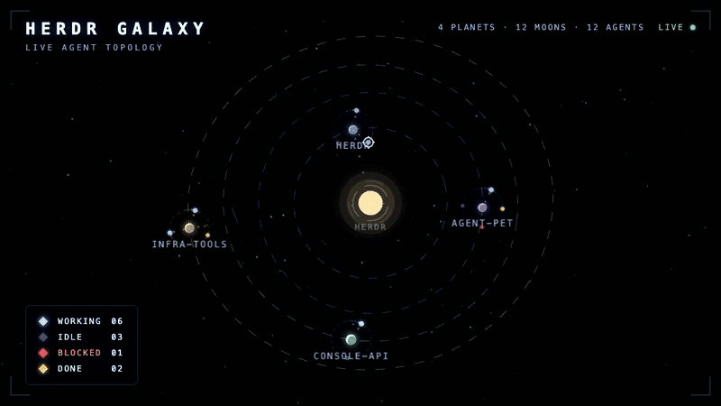
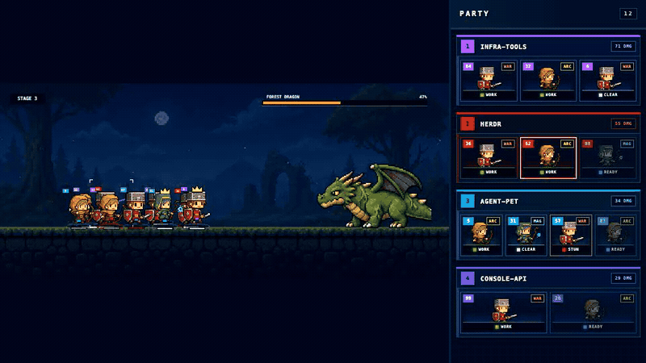
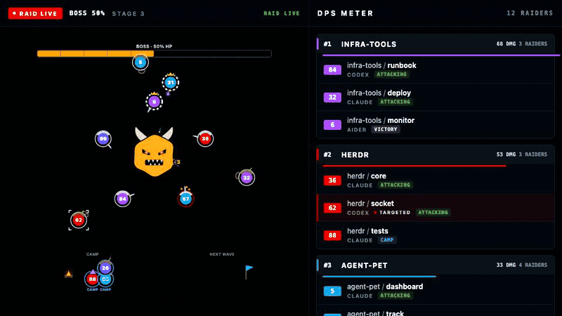
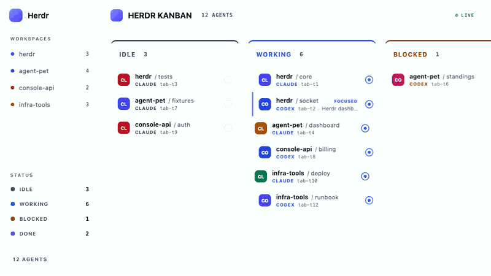
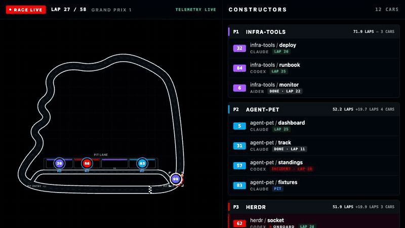
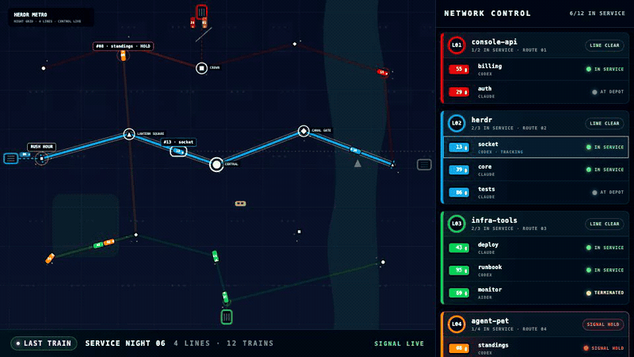

# Herdr Visual Lab

[English](./README.md) | 한국어

Herdr에서 일하는 코딩 에이전트를 더 재미있게 바라보는 방법을 실험하는
대시보드 플레이그라운드입니다.

하나의 실시간 세션을 은하, 레이스, 레이드, 우주 정거장처럼 서로 다른 세계로
재해석합니다. 에이전트의 상태와 움직임을 어떤 화면이 가장 직관적이고 즐겁게
보여 주는지, 다양한 모드를 빠르게 만들고 직접 비교해 봅니다.

## 실행 방법

요구 사항:

- Node.js 20 이상
- Herdr 0.7.4 이상

```sh
npm install
npm run build
npm link
herdr-visual-lab
```

실행하면 `http://127.0.0.1:4158`이 기본 브라우저에서 열립니다. 종료하려면
터미널에서 `Ctrl+C`를 누릅니다.

Herdr 없이 화면만 확인하려면 fixture를 사용합니다.

```sh
herdr-visual-lab --fixture grid
```

사용 가능한 옵션:

```text
herdr-visual-lab [options]

--port <n>        시작 포트 지정 (기본값: 4158)
--no-open         브라우저를 자동으로 열지 않음
--socket <path>   Herdr Unix socket 경로 지정
--fixture <name>  샘플 데이터로 실행
--speed <n>       화면 진행 속도 배율 지정
```

fixture는 `grid`, `dense`, `redflag`, `error`, `podium` 중 하나를 사용할 수 있습니다.

## 모드

실행 중인 서버의 `?game=` 쿼리로 모드를 선택합니다.

### Galaxy

세션은 은하핵, workspace는 항성, tab은 행성, agent는 위성으로 표현합니다. 기본
모드이므로 쿼리 없이 접속해도 열립니다.

```text
http://127.0.0.1:4158/
http://127.0.0.1:4158/?game=galaxy
```



### Raid 2

agent와 보스의 전투를 사이드뷰 2D 전장과 캐릭터 애니메이션으로 표현합니다.

```text
http://127.0.0.1:4158/?game=raid2
```



### Raid

workspace는 길드, agent는 보스를 공격하는 레이더로 표현합니다.

```text
http://127.0.0.1:4158/?game=raid
```



### Kanban

agent를 `IDLE`, `WORKING`, `BLOCKED`, `DONE` 상태별 열에 표시합니다.

```text
http://127.0.0.1:4158/?game=kanban
```



### F1

workspace는 레이싱 팀, agent는 서킷을 달리는 차량으로 표현합니다.

```text
http://127.0.0.1:4158/?game=f1
```



### Metro

workspace는 지하철 노선, agent는 심야 도시를 운행하는 열차로 표현합니다.

```text
http://127.0.0.1:4158/?game=metro
```


